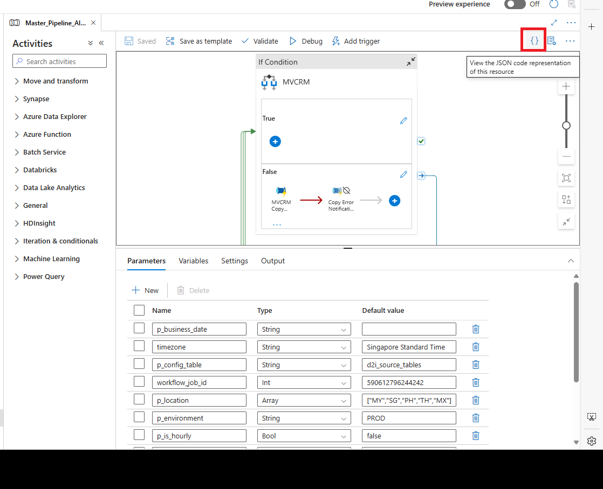

# How to Understand and Export Your Azure Data Factory Pipeline

## Viewing the Pipeline's JSON Code

In Azure Data Factory (ADF), you can easily see the JSON code that represents your entire pipeline. To do this, simply click on the curly brackets `{}` icon. This will display the JSON structure of your pipeline, including all the activities, parameters, variables, and other settings.



## Limitations of the JSON Representation

However, please note that the JSON file you get by clicking the `{}` icon does **not** include everything you might need to fully understand your pipeline. Here are some important components that are usually missing:

1. **Linked Services**: If your pipeline connects to external resources like Azure Data Lake, Azure SQL, or Databricks, the configuration details for these linked services are not included in the pipeline's JSON. You will need to check each linked service's JSON definition separately.

2. **Referenced Pipelines**: If your pipeline calls other pipelines using activities like `ExecutePipeline`, the details of those pipelines are not included. You will have to access their JSON files individually.

3. **Global Parameters**: Any global parameters your pipeline uses are not fully defined within its JSON file. You'll need to look at the global parameter configurations separately.

4. **Triggers**: Triggers that start your pipeline (like those based on schedules or events) are not included in the pipeline's JSON. They are managed separately in the ADF interface.

5. **Data Flows**: If your pipeline contains data flows, the JSON only references them. You'll need to view the details of the data flows separately.

6. **Azure Integration Runtime Configurations**: These settings are also referenced but not fully included in the pipeline's JSON.

**In short**, while the JSON representation gives you a detailed view of your pipeline's structure, you need to explore these additional configurations and resources to fully understand how your pipeline works.

## How to Copy the Entire ADF Pipeline

If you want to copy and export the entire pipeline along with all its related resources (like linked services, datasets, and any referenced pipelines), here's how you can do it:

### 1. Use ARM Template Export

Azure Data Factory allows you to export your pipeline and all related resources as an **Azure Resource Manager (ARM) Template**. This method includes all dependencies and is the most comprehensive way to copy everything.

- **Go to Your Data Factory**: Open your Data Factory instance in the Azure Portal.

- **Access the Manage Tab**: Click on the **"Manage"** tab on the left side.

- **Export ARM Template**: Under the **"ARM template"** section, click on **"Export ARM template"**.

- **Select All Components**: Make sure to select all the components you want to export, such as pipelines, linked services, datasets, triggers, and global parameters. This will package everything into a single JSON-based ARM template.

- **Download the Template**: Save the template file to your computer.

- **Deploy to Another Environment**: You can import this template into another Data Factory by using the **"Deploy ARM template"** option in the **"Manage"** section of the target Data Factory, or by using PowerShell or the Azure CLI.

### 2. Use Git Integration for Source Control

If your Azure Data Factory is connected to a Git repository like Azure DevOps or GitHub, all your pipeline components are already stored there.

- **Clone the Repository**: Download the repository to your computer. It contains all pipelines, datasets, linked services, triggers, and global parameters.

- **Deploy to Another Environment**: Use the files from the repository to deploy to another Azure Data Factory instance or to examine the structure locally.

### 3. Manually Export Pipeline and Related Resources

Refer to the section [Migrating Azure Data Factory Pipelines Without Rebuilding Them](#migrating-azure-data-factory-pipelines-without-rebuilding-them)

### 4. Use Azure CLI or PowerShell

You can also use Azure CLI or Azure PowerShell to export your Data Factory components.

**Using Azure CLI**:

```bash
az datafactory export-pipeline --factory-name <your_data_factory_name> \
                               --resource-group <your_resource_group_name> \
                               --name <your_pipeline_name> \
                               --output-path <output_file_path>
```

You can run similar commands to export linked services and datasets.

### 5. Deploy Everything to Another Environment

Once you have your ARM template or exported JSON files:

- **For ARM Templates**: Use the **"Deploy ARM template"** option in the new Data Factory or deploy via Azure CLI or PowerShell.

- **For Git Integration**: Push the files to the repository associated with the target Data Factory.

- **For Manual Exports**: Recreate each component in the new Data Factory by importing their JSON files one by one.

### 6. Validate After Export

After importing or deploying, make sure to:

- **Validate the Pipeline**: Check that all components are working correctly.

- **Update Environment-Specific Settings**: Adjust any settings that are specific to the new environment, such as service credentials, authentication details, or resource URLs.

## Summary

To export your **entire** pipeline with all dependencies:

- **Best Method**: Use the **ARM template export** feature in Azure Data Factory. This method includes everything—pipelines, datasets, linked services, triggers, and more.

- **Alternative Method**: Use **Git integration** for version control and easy transfer between environments.

- **Manual Method**: If necessary, export the pipeline and its components individually.


# Migrating Azure Data Factory Pipelines Without Rebuilding Them

Transferring data pipelines and their related resources from one Azure Data Factory (ADF) to another can be done smoothly without the need to recreate anything. Here's how you can achieve this:

## Method 1: Moving a Single Pipeline to Another Data Factory

1. **Access Your Source Data Factory**: Log in to the ADF instance where your existing pipelines are located.

2. **Select the Pipeline**: Navigate to the specific pipeline you want to migrate.

3. **Download Support Files**:
   - Hover over the pipeline.
   - Click on the action menu (three dots).
   - Choose **"Download Support Files"**.

4. **Extract the Files**: Unzip the downloaded folder. You'll find all the support files, including the pipeline, datasets, linked services, triggers, and integration runtimes.

5. **For Multiple Pipelines**: If you need to transfer more pipelines, repeat steps 2 to 4 for each one and organize the files accordingly.

6. **Clone Your Git Repository**:
   - Use `git clone` to create a local copy of your Azure DevOps Git repository.
   - Create a new branch from your main branch, for example, `import_pipelines`.

7. **Check the Branch Contents**: Look into your new branch `import_pipelines` to see the existing folders and files.

8. **Place the Downloaded Resources**:
   - Copy the extracted files into the corresponding folders in your repository:
     - **datasets** → place dataset files here.
     - **DataFactoryPipelines** → place pipeline files here.
     - **trigger** → place trigger files here.
     - **linkedService** → place linked service files here.

9. **Commit and Push Changes**:
   - Use Git commands or a GUI tool to commit your changes.
   - Push the `import_pipelines` branch to the `develop` branch of the target Data Factory.

10. **Publish in the New Data Factory**: After pushing, go to the target ADF and publish the changes. Your migrated pipeline should now appear there.

## Method 2: Transferring All Pipelines to Another Data Factory

1. **Open Azure DevOps**:
   - Log in to your Azure DevOps account.
   - Navigate to the **Pipelines** section.

2. **Create a CI/CD Pipeline**:
   - Set up a Continuous Integration/Continuous Deployment pipeline.
   - Configure it to deploy resources from your `develop` branch to the desired environment (e.g., `test`).

3. **Configure Deployment Settings**:
   - In the pipeline, specify the destination resource group and subscription where the new Data Factory resides.
   - Provide the ARM (Azure Resource Manager) template from your source Data Factory.

4. **Run the Pipeline and Verify**:
   - Execute the pipeline to deploy the resources.
   - Check the target Data Factory to ensure all pipelines and resources have been transferred.
