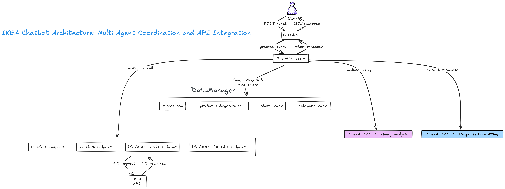
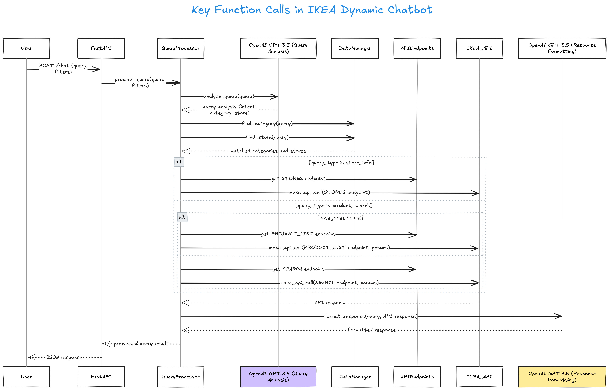
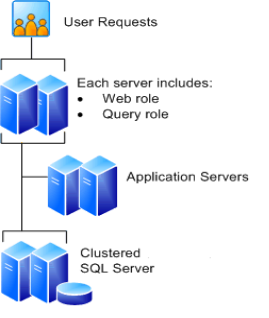

# Welcome to Das Digital Digest

Welcome to my personal website, where I share insights and experiences from my journey in data engineering, cloud migration, and technology. Here, you'll find detailed accounts of projects I've worked on, the challenges I've faced, and the solutions I've implemented.

!!! Quote "About Me"

    Born in West Bengal, I grew up moving across India due to my father’s career in the defense forces. My mother is a homemaker. I attended army schools and later moved to Kolkata for higher education, completing a B.Sc. (Hons) in Physics with a minor in Mathematics from the [University of Calcutta](https://www.caluniv.ac.in/) and a Master’s in Computer Application from [West Bengal University of Technology](https://makautwb.ac.in/).

    I relocated to Singapore in 2007. The same year, I started dating my wife, and we married in 2010. We have a daughter. My wife holds a bachelor’s and master’s in biotechnology from [St. Xavier’s College](https://www.sxccal.edu/), Kolkata, and a PhD and postdoc from [Nanyang Technological University](https://www.ntu.edu.sg/), Singapore. She currently works as Senior Scientist/Senior Assistant Director at [A*STAR](https://www.a-star.edu.sg/).

    I began my career as a final-year intern at [HCL Technologies](https://www.hcltech.com/), working on .NET and MSSQL, and was later seconded to Singapore. Since 2007, I have worked across Singapore, Canada, and Amsterdam on Data and ECM projects, primarily on Microsoft platforms. From 2017 onwards, my focus shifted to Azure and Government Cloud migration projects. Currently, I serve as Senior Manager/Data Engineer at [IRAS](https://www.iras.gov.sg/) (Ministry of Finance, Singapore), supporting data migration to Azure Government Commercial Cloud (GCC). Over the years, I have worked across services and product companies in government and private sectors, gaining experience in end-to-end technology implementation and cloud adoption.

## Projects and responsibilities

??? tabs "Data & ETL Migration to Azure Government Commercial Cloud (GCC)"
    === "Background"

        Currently I work as a Senior Manager / Data Engineer at IRAS (Inland Revenue Authority of Singapore), Ministry of Finance, Singapore. My day-to-day works involves migrating data from on-prem SQL Server to Azure Synapse Analytics (Dedicated & Serverless) using Azure Data Factory and PySpark (Synapse Spark Pool). I also rewrite legacy SAS SQL scripts into PySpark for Synapse Spark Pool. Additionally, I am migrating 120+ Hadoop/Hive ETL workflows to Synapse Serverless with ADLS. I collaborate with Data Scientists and ML Engineers on data preparation and integration tasks.

        - **Project:** Data and ETL Migration from On-Prem to Azure Government Commercial Cloud (GCC) 
        - **Role:** Senior Manager / Data Engineer  
        - **Team:** 20+ members across Data Engineering, Digital Infrastructure, Data Science, and AI  
        - **Objective:**  
            - Migrate on-prem SQL tables to Synapse Analytics (Serverless Delta Lake tables and Dedicated Pool) using Azure Data Factory and PySpark (Synapse Spark Pool).  
            - Rewrite SAS SQL scripts into PySpark for Synapse Spark Pool.  
            - Transition Hadoop/Hive ETL workflows to Synapse Serverless with ADLS.  
            - Collaborate with Data Scientists and ML Engineers on data preparation and integration tasks.  

    === "Tech Stack"
        - Azure Government Commercial Cloud (GCC)  
        - Azure Data Factory  
        - Synapse Analytics (Dedicated & Serverless)  
        - ADLS  
        - PySpark / Synapse Spark Pool  
        - Hadoop / Hive
        - Azure DevOps  
        - GitHub Copilot  
        - MLflow / Kedro  

    === "Responsibilities"
        - Migrated data from on-prem SQL tables to Azure Synapse (Dedicated & Serverless) using ADF and PySpark.  
        - (In-progress)Migrating 120+ Hadoop/Hive ETL workflows to Synapse-ADLS.  
        - (In-progress)Converting legacy SAS SQL scripts into PySpark for Synapse Spark Pool.  
        - Provided technical guidance on PySpark Script optimization and best practices.  
        - Worked with Data Scientists to refine datasets for model development.  
        - Provided CI/CD pipeline guidance using Azure DevOps.  
        - Conducted PoC comparing Kedro and MLflow for MLOps.  
        - Supported user access and security in Azure GCC. 
        - Worked with other government agency teams to onboard GitHub Copilot and worked with vendors to resolve security issues.  

??? tabs "Gen-AI Chatbot Prototype for IKANO Retail"
    === "Background"
        - **Role:** Assistant Manager / Data Engineer  
   
        **Problem**
        IKEA partnered with Sprinklr to build a GenAI assistant for their retail website. My role was to coordinate requirements, design the architecture, and provide technical guidance. The main challenge was bridging IKEA’s complex multi-country API ecosystem (Singapore, Malaysia, Philippines, Thailand, Mexico) with Sprinklr’s chatbot requirements. The chatbot needed to understand queries like “show me white wardrobes under $500” and translate them into specific API calls with correct filters and category mappings.

        **Solution**
        I developed a FastAPI-based chatbot prototype that integrates directly with IKEA’s live APIs. The system uses a multi-agent approach: GPT-3.5 first analyzes user intent (product vs. store info), extracts details (category, store, filters), and a second LLM pass formats API responses into conversational replies. The prototype maintains indexed mappings of product categories and store locations, dynamically processes filters (color, material, price), and demonstrates every integration point for stakeholders. It ran locally and handled live queries against IKEA’s production APIs.

        

        **Results**
        
        The prototype showed that a GenAI chatbot could be built directly on top of IKEA’s APIs. It gave a clear architecture for Sprinklr to use. Before this, there was confusion on how to handle filters, categories, and store logic. The prototype removed that uncertainty and showed what users wanted and what Sprinklr was offering. With just the APIs and GPT-3.5, we built a working chatbot, and the project picked up momentum after that.
         

    === "Implementation"

        

        ```python
        # FastAPI-based IKEA Gen-AI Chatbot Prototype (Dec 2024)
        # Handles queries like: "Show me white wardrobes", with dynamic filters and API integration

        import os, json, logging
        from typing import Dict, List, Optional, Any
        from fastapi import FastAPI, HTTPException
        from pydantic import BaseModel
        import httpx
        from openai import OpenAI
        from dotenv import load_dotenv

        logging.basicConfig(level=logging.INFO)
        logger = logging.getLogger(__name__)

        load_dotenv()
        app = FastAPI()

        MARKET = os.getenv("MARKET", "sg")
        LANGUAGE = os.getenv("LANGUAGE", "en")
        CLIENT_ID = os.getenv("CLIENT_ID", "aiseaapp")
        VERSION = os.getenv("VERSION", "20240110")

        class APIEndpoints:
            def __init__(self, market, language):
                self.STORES = f'https://www.ikea.com/{market}/{language}/meta-data/navigation/stores.json'
                self.SEARCH = f'https://sik.search.blue.cdtapps.com/{market}/{language}/search-result-page'
                self.PRODUCT_LIST = f'https://sik.search.blue.cdtapps.com/{market}/{language}/product-list-page'

        class DataManager:
            def __init__(self):
                self.stores = self._load_json('stores.json')
                self.categories = self._load_json('product-categories.json')
                self.store_index = self._index_stores()
                self.category_index = self._index_categories()

            def _load_json(self, filename):
                try:
                    with open(filename, 'r') as f:
                        return json.load(f)
                except Exception:
                    return {}

            def _index_stores(self):
                return {store['displayName'].lower(): {'id': store['id']} for store in self.stores}

            def _index_categories(self):
                return {cat['title'].lower(): {'id': cat['id']} for cat in self.categories}

            def find_category(self, query):
                query_terms = query.lower().split()
                return [{"id": data["id"], "title": name} for name, data in self.category_index.items()
                        if all(term in name for term in query_terms)]

            def find_store(self, query):
                return [{"id": data["id"], "name": name}
                        for name, data in self.store_index.items()
                        if any(term in name for term in query.lower().split())]

        class QueryProcessor:
            def __init__(self, api_key):
                self.client = OpenAI(api_key=api_key)
                self.data_manager = DataManager()
                self.api_endpoints = APIEndpoints(MARKET, LANGUAGE)

            def analyze_query(self, query):
                try:
                    response = self.client.chat.completions.create(
                        model="gpt-3.5-turbo",
                        messages=[
                            {"role": "system", "content": "Analyze IKEA query and extract query_type, category, store, requirements as JSON."},
                            {"role": "user", "content": query}
                        ]
                    )
                    return json.loads(response.choices[0].message.content)
                except Exception:
                    return {}

            async def make_api_call(self, endpoint, params=None):
                base_params = {'c': CLIENT_ID, 'v': VERSION}
                if params:
                    filters = params.pop('filters', {}) if 'filters' in params else {}
                    base_params.update(filters)
                    base_params.update(params)
                async with httpx.AsyncClient() as client:
                    response = await client.get(endpoint, params=base_params)
                    response.raise_for_status()
                    return response.json()

            async def process_query(self, query, filters=None):
                analysis = self.analyze_query(query)
                categories = self.data_manager.find_category(query)
                stores = self.data_manager.find_store(query)
                params = {}
                if filters:
                    params['filters'] = filters
                api_responses = []
                if analysis.get('query_type') == 'store_info':
                    api_responses.append(await self.make_api_call(self.api_endpoints.STORES))
                elif analysis.get('query_type') == 'product_search':
                    if categories:
                        for category in categories:
                            search_params = {'category': category['id'], 'store': stores[0]['id'] if stores else '022', **params}
                            api_responses.append(await self.make_api_call(self.api_endpoints.PRODUCT_LIST, search_params))
                    else:
                        search_params = {'q': query, 'types': 'PRODUCT', **params}
                        api_responses.append(await self.make_api_call(self.api_endpoints.SEARCH, search_params))
                formatted_response = "I apologize, but I couldn't retrieve the information you requested."
                if api_responses:
                    try:
                        response = self.client.chat.completions.create(
                            model="gpt-3.5-turbo",
                            messages=[
                                {"role": "system", "content": "Format IKEA data into helpful response."},
                                {"role": "user", "content": f"Query: {query}\nData: {json.dumps(api_responses)}"}
                            ]
                        )
                        formatted_response = response.choices[0].message.content
                    except Exception:
                        pass
                return {'query': query, 'analysis': analysis, 'response': formatted_response}

        class ChatRequest(BaseModel):
            query: str
            filters: Optional[Dict[str, Any]] = None

        @app.post("/chat")
        async def chat(request: ChatRequest):
            query = request.query
            filters = request.filters
            if not query:
                raise HTTPException(status_code=400, detail="No query provided")
            processor = QueryProcessor(os.getenv('OPENAI_API_KEY'))
            return await processor.process_query(query, filters)

        if __name__ == '__main__':
            import uvicorn
            uvicorn.run(app, host='127.0.0.1', port=5000)
        ```

??? tabs "CI/CD Pipeline for Databricks Git Synchronization for IKANO Retail"
    === "Background"
        IKANO retail data platform runs on Azure with Databricks, ADF, DBT, and Power BI. The platform processes data across 5 countries (SG, MY, PH, TH, MX) with master pipelines running twice daily, orchestrating 50+ Databricks jobs.

        **Issue:**  
        Databricks Git integration doesn't automatically sync when code is pushed to Azure DevOps. Developers had to manually pull changes in Databricks after every commit. Authentication tokens expired periodically, breaking deployments silently. This manual process was unreliable for a platform processing critical daily data flows.

        **Solution:**
        I designed an Azure DevOps pipeline that triggers on commits to the main branch. The pipeline uses the Databricks CLI to authenticate via service principal, update Git credentials with a fresh token, and sync the Databricks repo to the latest commit. This automated approach ensures Databricks always has the latest code without manual intervention.


    === "Implementation"
        **Pipeline Config**
        ```yaml
        trigger:
        - ar_iac_databricks

        jobs:
        - job: 'dbt_code_deploy'
        displayName: 'Deploy code on Databricks repos'
        timeoutInMinutes: 10
        pool:
            vmImage: ubuntu-latest

        variables:
        - group: azure-env-prod
        - name: databricks_git_credentials_id
            value: 'xxx'
        - name: databricks_repository_id
            value: 'xxx'
        - name: branch_name
            value: 'ar_iac_databricks'
        ```

        **Auth & Sync Steps**
        ```yaml
        steps:
        - script: sudo apt update && sudo apt install curl jq -y
        displayName: 'Install tools'

        - script: curl -fsSL https://raw.githubusercontent.com/databricks/setup-cli/main/install.sh | sh
        displayName: 'Install databricks-cli'

        - script: | 
            echo '[databricks-profile]' >> ~/.databrickscfg
            echo "host=$(DATABRICKS_PROD_URL)" >> ~/.databrickscfg
            echo "azure_tenant_id=$(AZURE_TENANT_ID)" >> ~/.databrickscfg
            echo "azure_client_id=$(AZURE_CLIENT_ID)" >> ~/.databrickscfg
            echo "azure_client_secret=$AZURE_CLIENT_SECRET" >> ~/.databrickscfg
        env:
            AZURE_CLIENT_SECRET: $(AZURE_CLIENT_SECRET)
        displayName: 'Setup databricks config'

        - script: |
            curl -X POST -H 'Content-Type: application/x-www-form-urlencoded' \
            https://login.microsoftonline.com/$(AZURE_TENANT_ID)/oauth2/v2.0/token \
            -d client_id=$(AZURE_CLIENT_ID) \
            -d grant_type=client_credentials \
            -d scope=xxx/.default \
            -d client_secret=$AZURE_CLIENT_SECRET | jq '.access_token' -r > ~/.ado_token
        displayName: 'Get fresh token'

        - script: |
            databricks git-credentials update \
            $(databricks_git_credentials_id) \
            "AzureDevOpsServices" \
            --personal-access-token "$(cat ~/.ado_token)" \
            --profile databricks-profile
        displayName: 'Update git credentials'

        - script: |
            databricks repos update \
            $(databricks_repository_id) \
            --branch $(branch_name) \
            --profile databricks-profile
        displayName: 'Sync repository'
        ```


??? tabs "Databricks, DBT, ADF and Gen-AI Solutions for IKANO Retail"
    === "Background & Project Overview"

    - Project: Databricks, DBT, ADF and Gen-AI Solutions for IKANO Retail
    - Role: Assistant Manager / Data Engineer

        **Background:**  

        The platform was built on Azure, Databricks, ADF (for orchestration), DBT (for SQL-based transformations), and Power BI (for reporting). It ingested data from multiple sources including **Dynamics MVBC, Dynamics MVCRM, SQL Server, SharePoint, Google BigQuery, and Yotpo**.  

        Data ingestion was done using **Databricks Autoloader** with transformations handled in **Databricks + DBT**. Two master ADF pipelines ran twice daily (SEA and Mexico), each orchestrating 50+ Databricks jobs and running for 5+ hours.  

        The setup processed **sales orders, CRM data, product and pricing references, POS transactions, inventory, promotions, and ad-hoc SharePoint extracts**, enabling country-specific reporting and cross-market insights. Dedicated ingestion jobs per country (SG, MY, PH, TH, MX) applied local rules and formats but were centrally orchestrated by **ADF and Databricks**.  

        **Master Pipeline:**  

        - Central orchestrator for 50+ Databricks jobs across SEA and Mexico  
        - Runs **twice daily**, handling ingestion, transformation, parameter passing, logging, and error handling  
        - Integrates data from **MVBC, MVCRM, Yotpo, web analytics, food outlets, and SharePoint**  
        - Outputs transformed data into **DBT models** that build analytics-ready (gold) tables for reporting and dashboards  

        **Responsibilities:**  

        - BAU support and monitoring of ADF + Databricks + DBT pipelines  
        - Day-to-day Azure/Databricks administration  
        - Optimize ADF and Databricks workflows to reduce Azure costs  
        - Plan migration of Hive-based workloads into **Databricks Unity Catalog**  
        - Build an internal knowledge platform for documentation and learning  

    === "Tech Stack"
        - Azure (ADLS, ADF, Azure DevOps, ARM Templates)  
        - Databricks (Repos, Delta Lake, Autoloader, Unity Catalog)  
        - DBT (SQL/ELT transformations)  
        - Power BI  
        - Dynamics MVCRM / MVBC  
        - SharePoint  
        - Google BigQuery  
        - REST APIs (Ikano, Dynamics, internal systems)  
        - Weaviate (Vector Database)  
        - LangChain  
        - GPT-3.5 / GitHub Copilot  
        - Terraform & ARM Templates (infra automation, evaluation)  
        - GitHub-Jekyll / MkDocs / GitBook (knowledge platform, evaluation)  


??? tabs "Azure Databricks Migration for ML Data Preparation – Environmental Research Lab"
    === "Project and Team"
        - **Project:** Water Quality Data Migration from SharePoint to Azure  
        - **Role:** Data Engineer  
        - **Duration:** Jan 2024 – Sep 2024  
        - **Team:** 5 members (Data Engineer, Lab Technician, Azure Admin, Environmental Scientist, Data Analyst)  
        - **Domain:** Environmental Research – Water Purification  

        **Overview:**  
        Migrated water quality testing data to Azure Data Lake and set up Databricks pipelines for cleaning and preparing ML-ready datasets. Supported predictive modeling of water treatment effectiveness.

    === "Technical Work"
        - **Migration:**  
            - Copied 12,000+ CSV/Excel files (450GB) from SharePoint to Azure Data Lake using **Azure Data Factory** pipelines  
            - Verified file integrity and organized folders using **Python scripts**  

        - **Databricks Processing:**  

            - Ingested new CSV files with **Auto Loader**  
            - Cleaned and standardized key measurements (pH, turbidity, dissolved oxygen, contaminants) using **PySpark/DataFrame transformations**  
            - Performed basic data quality checks (range validation, missing values)  
            - Aggregated data for ML and reporting  

        - **Job Scheduling:**  

            - Daily Databricks jobs using **Workflows**  
            - Basic alerts on failures via **email/Slack**  

    === "Results & Impact"
        - Reduced data preparation from 2–3 weeks to 2 days  
        - Standardized units and flagged data errors  
        - Enabled trend analysis and ML model development for water treatment  

    === "Tech Stack"
        | Component      | Technology                        |
        |---------------|-----------------------------------|
        | **Source**    | SharePoint / Lab CSV files        |
        | **Migration** | Azure Data Factory, Python scripts |
        | **Storage**   | Azure Data Lake Storage Gen2       |
        | **Processing**| Azure Databricks (Auto Loader, PySpark) |
        | **Format**    | Delta Lake                        |
        | **Orchestration**| Databricks Workflows             |

    === "Challenges"
        - Variations in CSV formats → simple parsing and schema adjustments  
        - Missing/incorrect values → validation and cleaning steps  
        - Network drive connectivity → retry logic and batch transfers


??? tabs "Azure Databricks Migration for ML Data Preparation – Biotech Research Lab"
    === "Project and Team"

    - **Project:** Lab Data Migration from SharePoint to Azure  
    - **Role:** Data Engineer  
    - **Team:** 4 members (Data Engineer, Azure Admin, Lab Manager, Data Scientist)  
    - **Domain:** Biotech Research Lab  

    **Overview:**  
    Migrated 3 years of lab data from SharePoint to Azure Data Lake and set up Databricks pipelines for data cleaning, standardization, and ML-ready dataset preparation. Enabled faster data access and ML model development.

    === "Technical Work"

        - **Migration:**  
            - Azure Data Factory pipelines to transfer 8,000+ Excel/CSV files (750GB)  
            - Python scripts for validation, integrity checks, and folder organization  

    - **Data Processing:**  

        - Databricks notebooks for format standardization, missing/outlier handling  
        - Compound ID mapping, aggregation, and feature engineering for ML  
        - Generated data quality reports and visual checks  

    - **ML Output:**  

        - Compound screening: 45,000 records  
        - Protein binding: 12,000 measurements  
        - Cell viability: 38,000 data points  
        - Combined feature matrix for multi-target prediction

    === "Impact"

        - Reduced data prep time from weeks to hours  
        - Resolved 2,300+ duplicate records and standardized units  
        - Filled ~15% missing data via interpolation  
        - Delivered first ML prototype 2 months ahead of schedule  

    === "Tech Stack"

        | Component      | Technology                       |
        |---------------|----------------------------------|
        | **Source**    | SharePoint 2016                  |
        | **Migration** | Azure Data Factory               |
        | **Storage**   | Azure Data Lake Storage Gen2     |
        | **Processing**| Azure Databricks (Python)        |
        | **Development**| Jupyter notebooks, pandas, numpy |

    === "Challenges"

        - **Data inconsistencies:** Multiple Excel templates → Flexible parsing logic  
        - **Missing context:** Cross-referenced lab notebooks  
        - **Connectivity issues:** SharePoint timeouts → Retry logic, batch processing


??? tabs "SharePoint CSV Migration to SQL Server"
    
    === "Background"

       The project involved migrating CSV and Excel files from SharePoint 2013 (on-premises) to SQL Server 2016 for a retail client, mainly to support SSRS reporting. Over 200 files, updated weekly or monthly (50KB–50MB, with inconsistent headers and delimiters), were consolidated into a centralized SQL Server data warehouse. I architected the solution, selected the products and integration approach, and coordinated with DBAs, network teams, SharePoint admins, and business users. The design included a staging database for raw imports, normalized production tables for cleaned data, and audit tables for ETL logging. Built on SSIS 2016 with Visual Studio/SSDT, the pipelines automated file ingestion, validation, and transformation, reducing manual effort from 2 days to 2 hours and significantly improving data quality and standardization. The platform established a single SQL Server repository for downstream SSRS reports and analytics, with SQL Agent jobs managing scheduled execution.

        - **Project:** SharePoint CSV Migration to SQL Server  
        - **Role:**  Data Engineer / Architect  
        - **Team:** 6 members (SSIS Developers, DBAs, SharePoint Admins)  

    === "SSIS Implementation"
        - **Packages:** Flat File Source reading CSV/Excel  
        
        - **Workflows:**  

            - Foreach Loop containers for multiple files  
            - Data Flow tasks with conversion, validation, and cleansing  
            - Conditional Split to route valid and invalid records  
            - Script Tasks for file archiving and custom processing  
        
        - **Data Validation:**  

            - Row count checks before/after processing  
            - Data type conversions  
            - Business rule validation using Conditional Split  
            - Duplicate detection and error handling  
        - **Configuration & Logging:**  

            - Package configurations for different environments  
            - Dynamic file path variables  
            - Logging and notification for monitoring execution  

??? tabs "Azure Migration and Modernization of ETL Processes and Infrastructure"
    === "Project and Team"
        - **Project:** ETL Modernization and Infrastructure Migration to Azure  
        - **Role**: Solution Architect / Data Engineering Lead  
        - **Team**: 15 members including Data Engineers, ETL Developers, Azure Infrastructure Specialists, and cross-functional stakeholders  
        - **Objective**:  
            - Migrate legacy on-prem Windows Servers and SQL Server databases to Azure VM and Azure SQL PaaS.  
            - Modernize SSIS ETL pipelines for document and metadata processing.  
            - Enable scalable, automated, and highly available data workflows in Azure.  
            - Reduce on-prem maintenance cost and operational risk.  

    === "Tech Stack"
        - Azure VMs (Windows Server 2016)  
        - Azure SQL Database (PaaS)  
        - SSIS / SSRS  
        - SQL Server Management Studio  
        - Power BI  
        - Docker (for legacy ECM apps)  
        - SharePoint Online  

    === "Role & Responsibilities"

        - Designed Azure-based architecture, including VM sizing, SQL PaaS, and high availability planning.  
        - Migrated on-prem SSIS ETL packages to Azure VM-hosted SQL Server, optimizing for performance and reliability.  
        - Re-engineered SSIS packages to process document metadata from legacy ECM systems efficiently.  
        - Built Azure SQL tables and schemas to capture document and operational data.  
        - Implemented automation for metadata extraction, validation, and ingestion from multiple sources.  
        - Configured Azure DR and HA strategies, including geo-redundant backups and site recovery.  
        - Conducted POCs for performance tuning of SSIS workflows and SSRS reporting.  
        - Collaborated with cross-functional teams and vendors to provision Azure infrastructure and ensure secure access.  
        - Developed technical documentation, deployment guides, and trained internal teams on new cloud-based ETL workflows.  
        - Monitored pipeline performance post-migration and ensured data quality and integrity.  

    === "Key Achievements"
    
        - Successfully migrated all on-prem SSIS ETL workflows to Azure VMs and Azure SQL.  
        - Reduced infrastructure maintenance cost by ~40% by leveraging Azure PaaS and VM-based ETL hosting.  
        - Improved ETL execution performance by ~50% through optimized SSIS workflows and SQL tuning.  
        - Enabled high availability and disaster recovery for mission-critical financial data.  

??? tabs "SSIS-based ETL Solution For a Multinational Bank"

    === "Project Overview"
        **Background**

        This project was for a leading multinational bank with its hub in Singapore and branches across Southeast Asia. The goal was to build an ETL framework to process structured XML data from the bank’s document capture platform and integrate it with their existing SQL Server systems. SSIS was chosen as the ETL tool since it was already part of the SQL Server stack and required minimal changes to security or infrastructure.

        **Project Details:**  
        - **Role:** Solution Architect / Onsite coordinator
        - **Team Size:** 12 members (ETL developers, database architects, business analysts, DBAs)  
        - **Domain:** Banking & Financial Services - Document Processing
        - **Pilot Scope:** Credit Card Applications & Account Opening (with expansion roadmap)

        **Responsibilities**
        In this project, I worked as a solution architect and onsite coordinator, focusing on the design and development of the ETL framework. My role covered selecting the right SQL Server–based tools, designing the core data integration approach, and building key SSIS workflows. I collaborated with business analysts to turn requirements into technical specifications, ensured data quality checks were in place, and tuned performance for high-volume processing. Alongside my own development work, I supported the offshore team by reviewing packages and providing technical guidance where needed.


    === "Architecture"
        **Overall System Architecture:**
        ```mermaid
        graph TB
            subgraph "Document Sources"
                DOC[Banking Documents<br/>Credit Cards / Accounts<br/>Paper / Digital Forms]
            end
            
            subgraph "Document Processing (Existing)"
                CAPTIVA[EMC Captiva<br/>Document Capture & OCR]
                XML[XML Files<br/>Network Shared Folder<br/>\\BankingData\XMLExport\]
            end
            
            subgraph "Microsoft ETL Platform - SQL Server 2008"
                VS[Visual Studio 2008<br/>SSIS Package Development<br/>BI Development Studio]
                
                subgraph "SSIS ETL Framework"
                    MASTER[Master Controller<br/>SSIS Parent Package<br/>Orchestration & Scheduling]
                    CC[Credit Card ETL<br/>Risk Assessment<br/>Validation Rules]
                    AO[Account Opening ETL<br/>KYC Processing<br/>Compliance Checks]
                end
                
                SSMS[SQL Server Management Studio<br/>DB Administration<br/>Performance Monitoring]
            end
            
            subgraph "SQL Server 2008 Database Infrastructure"
                STAGING[(Staging Database<br/>Raw XML Import)]
                EDW[(Enterprise Data Warehouse<br/>Clean & Processed Data)]
                AUDIT[(Audit Database<br/>Process Logs & Lineage)]
            end
            
            subgraph "Monitoring & Reporting"
                SSRS[ETL Monitoring Dashboards<br/>Business Reports]
                ALERTS[SQL Server Agent<br/>Job Scheduling<br/>Email Alerts]
            end
            
            subgraph "Regional Deployment"
                SG[SG Hub<br/>Primary Processing]
                MY[MY Node<br/>Local Compliance]
                TH[TH Node<br/>Local Compliance]
                ID[ID Node<br/>Local Compliance]
                PH[PH Node<br/>Local Compliance]
            end
            
            DOC --> CAPTIVA
            CAPTIVA --> XML
            XML --> MASTER
            
            VS -.->|Develops| MASTER
            VS -.->|Develops| CC
            VS -.->|Develops| AO
            SSMS -.->|Manages| STAGING
            SSMS -.->|Manages| EDW
            
            MASTER --> CC
            MASTER --> AO
            CC --> STAGING
            AO --> STAGING
            STAGING --> EDW
            CC --> AUDIT
            AO --> AUDIT
            
            EDW --> SSRS
            AUDIT --> SSRS
            MASTER --> ALERTS
            
            EDW -.->|Replicates to| SG
            EDW -.->|Replicates to| MY
            EDW -.->|Replicates to| TH
            EDW -.->|Replicates to| ID
            EDW -.->|Replicates to| PH
            
            style VS fill:#e1f5fe
            style SSMS fill:#e1f5fe
            style SSRS fill:#e1f5fe
            style ALERTS fill:#e1f5fe
            style MASTER fill:#fff3e0
            style CC fill:#fff3e0
            style AO fill:#fff3e0
            style STAGING fill:#f3e5f5
            style EDW fill:#f3e5f5
            style AUDIT fill:#f3e5f5
        ```
        **Data Quality**
        We built in basic data quality checks at the ETL stage:

            - XML schema validation (XSD)
            - Business rule checks (credit scoring, risk, compliance)
            - Required field and format validation
            - Reference data lookups (country codes, branch codes, products)
            - Audit trail to track records end-to-end

        **Performance Tuning**
        To handle large volumes, we tuned SSIS for speed:

            - Ran packages in parallel where servers allowed
            - Used bulk loading (OLE DB with batch commits)
            - Adjusted buffer sizes and row limits for available memory
            - Disabled/rebuilt indexes during heavy loads
            - Reused database connections to reduce overhead

    === "Tech Stack"
        - SQL Server 2008 R2 (Database + SSIS)
        - SSIS (ETL framework for XML extraction, validation, and loading)
        - SQL Server Agent (job scheduling and automation)
        - SQL Server Management Studio (database administration and queries)
        - BIDS (SSIS package development)
        - C# script tasks/components for XML parsing, schema validation, and file handling where out-of-the-box SSIS wasn’t sufficient
        - File System tasks in SSIS for handling file detection/movement
        - SSRS for general reports and ETL monitoring dashboards
        - Windows Server 2008 (application and database servers)
        - SQL Server failover clustering (Was already implemented for high availability)

??? tabs "SSIS-based ETL Solution Architecture – Major Oil & Gas Company"
    === "Project Overview"
        **Background:**

        This project was for a major oil & gas company. Their existing data capture system produced XML files—mainly invoices and contracts—from multiple countries (Angola, Egypt, ANZ, Iberia, Germany). I led the development of  ETLs in SSIS to extract, validate, and transform the XML, then load it into SQL Server for downstream consumers, including SAP and BI/reporting teams. SSIS was chosen because it was already in place, integrated with MSSQL and downstream systems, and required minimal changes to existing security and network setups.

        **Implementation Approach:**

        After gathering requirements, the XML schemas for invoices, contracts, and related documents were analyzed. The ETL was built in SSIS with reusable packages for parsing, validation, and staging. Custom C# libraries were used for handling complex XML structures, applying business rules, and data enrichment. A staging database managed raw data, and audit, monitoring, and alerting were implemented to track processing and handle errors. The processed data was then loaded into SQL Server for downstream systems including SAP.

        **Business Value:**

        During the initial phase, the solution automated processing of ~10k XML files per month with error handling and recovery. It provided clean, structured data for SAP and reporting teams, supported 24/7 processing with high availability. The solution was scalable, meaning additional ETLs could be added for new document types or departments.


        **Project Details:**

        - **Role:** Solution Architect / Lead Data Engineer
        - **Team:** 20 members (ETL developers, data engineers, QA specialists, business analysts)
        - **Domain:** Oil & Gas / Energy Sector
        - **Geographic Scope:** Angola, West Africa, and regional operations


    === "Tech Stack"
        **Core Data Platform:**

        - **Microsoft SQL Server 2008 R2 Enterprise** - Primary database platform and data warehouse
        - **SQL Server Integration Services (SSIS) 2008** - ETL orchestration and data transformation
        - **SQL Server Management Studio 2008** - Database administration and development
        - **Windows Server 2008 R2** - Application server infrastructure

        **Development & Integration:**

        - **Microsoft .NET Framework 4.0** - Custom component development and business logic
        - **Visual Studio 2008** - Integrated development environment
        - **C# Programming Language** - Custom ETL components and utilities
        - **PowerShell v2** - Automation scripting and monitoring

        **Supporting Technologies:**

        - **Microsoft Excel** - Business reporting and analytics dashboards
        - **Windows File System** - Source file monitoring and archival
        - **SQL Server Agent** - Job scheduling and workflow automation
        - **XML Schema Definition (XSD)** - Data validation and structure enforcement

    === "Solution Architecture"
 

        ```mermaid
        graph TB
            subgraph "Source Systems"
                FIELD_OPS[Field Operations<br/>Angola, Africa<br/>XML Files]
                VENDORS[Vendor Systems<br/>Batch XML Files]
                LEGACY[Legacy Systems<br/>Migration/Existing Data]
            end

            subgraph "ETL Layer"
                FILE_MONITOR[File Monitor<br/>Automated Detection]
                XML_PARSE[XML Parsing & Validation]
                TRANSFORM[Transformation & Business Rules]
                STAGING[Staging DB<br/>Temporary Storage<br/>Audit Tables]
                SSIS_ENGINE[SSIS Orchestration]
            end

            subgraph "Data Platform"
                SQL_SERVER[SQL Server 2008 R2<br/>DW & ODS]
            end

            subgraph "Consumers"
                SAP[SAP Team]
                BI[BI & Reporting]
                OPS[Operations Teams]
            end

            FIELD_OPS --> FILE_MONITOR
            VENDORS --> FILE_MONITOR
            LEGACY --> FILE_MONITOR

            FILE_MONITOR --> XML_PARSE
            XML_PARSE --> TRANSFORM
            TRANSFORM --> STAGING
            STAGING --> SSIS_ENGINE
            SSIS_ENGINE --> SQL_SERVER

            SQL_SERVER --> SAP
            SQL_SERVER --> BI
            SQL_SERVER --> OPS
        ```
    === "Responsibilities"
        I was the solution architect for the project. I defined the components and recommended the tech stack, analyzed the initial technical landscape, and looked at integration challenges and user requirements. I coordinated with the SAP team, DBAs, and the network team, and then designed the SSIS solution to meet the needs of the business and downstream systems.

??? tabs "SharePoint 2010 Data Ingestion - SDL Tridion Netherlands (Now RWS Group) B.V."
    === "Project and Team"
        - **Client/Company:** SDL Dev Labs (Now [RWS](https://www.rws.com/content-management/tridion/) Group)  
        - **Role:** Technical Engineer  
        - **Team:** 10 members (Product Team for ECM/WCM solutions) 
        - **Domain:** Web Content Management / Enterprise Content Management 
        - **Objective:**  
            - Design and implement data ingestion workflows from digital documents to SharePoint CMS and Tridion WCM.  
            - Ensure metadata extraction, content transformation, and proper publication pipeline.  
            - Provide technical support to customers for seamless WCM/ECM operations.  

    === "Tech Stack"
        - SDL Tridion Product Suite  
        - SharePoint 2010 / SharePoint Designer 2010  
        - SQL Server 2008  
        - Visual Studio 2008  
        - C#.NET, VBA  

    === "Role & Responsibilities"
        - Developed end-to-end **data ingestion workflows**: digital documents → OCR-based metadata extraction → SharePoint CMS.  
        - Built workflows for content lifecycle: initial creation in SharePoint → editing and publication in Tridion.  
        - Provided ongoing **technical support** to customers and internal teams.  
        - Ensured high quality and reliability of content workflows, improving customer satisfaction.  
        - Received recognition for delivering excellent support and contributing to improved **CSAT scores**.  


??? tabs "SharePoint 2007 – Stanardalone to 6-Server Farm Migration"
    === "Project Overview"
        **Background:**

        This project involved migrating a standalone SharePoint 2007 deployment to a 6-server farm for a logistics and supply chain company in Amsterdam. I designed the farm with redundancy and load balancing, set up SQL Server 2008 R2 Active/Passive failover clusters, and implemented the necessary network and load balancing infrastructure. Around 50 site collections were migrated with minimal downtime, and governance, security, and operational procedures were established.


        **Implementation Approach**

        The project involved migrating a standalone SharePoint 2007 deployment to a 6-server farm. The work started with planning and architecture design, including stakeholder workshops, analyzing the existing environment, defining growth requirements, and creating hardware and procurement plans. SQL Server 2008 R2 failover clusters were implemented with shared storage, backup, and recovery procedures, coordinating with networking and infrastructure teams. The SharePoint farm was deployed across multiple servers, with service applications distributed, F5 load balancer configured, and business requirements integrated. Site collections were migrated in phases using stsadm, with end-user validation, monitoring, and performance tracking. Operational procedures, monitoring dashboards, and alerting frameworks were established, and the production cutover was executed with infrastructure and business teams.

        

        **Project Details:**

        - **Role:** SharePoint and SQL Server Architect
        - **Location:** Amsterdam, Netherlands (Client-side deployment)
        - **Team:** 15+ members (infrastructure engineers, DBAs, SharePoint developers, network architects)
        - **Domain:** Global Logistics & Supply Chain

    === "Tech Stack"
        **Core Platform:**

        - **SharePoint 2007 (MOSS)** - Enterprise portal and collaboration platform
        - **SQL Server 2008 R2 Enterprise** - Database engine with failover clustering
        - **Windows Server 2008 R2** - Database servers
        - **Windows Server 2003 R2 SP2** - SharePoint farm servers
        - **IIS 6.0** - Web server platform

        **Infrastructure & Hardware:**

        - **F5 BIG-IP LTM** - Hardware load balancer with SSL acceleration
        - **EMC SAN Storage** - Shared storage with Fiber Channel 8Gbps
        - **Dell PowerEdge Servers** - Enterprise server hardware
        - **VMware vSphere** - Virtualization platform for supporting services

        **Development & Management:**

        - **SharePoint Designer 2007** - Site customization and workflow design
        - **Visual Studio 2008** - Custom component development
        - **SQL Server Management Studio** - Database administration
        - **Visual Source Safe 2005** - Source code management

    === "Solution Architecture"
        **6-Server Farm Overview:**
        ```mermaid
        graph TB
            subgraph "Load Balancing Tier"
                F5[F5 BIG-IP Load Balancer<br/>SSL Termination<br/>Health Monitoring]
            end
            
            subgraph "Web Tier"
                WFE1[Web Front-End 1<br/>Windows 2003 R2<br/>IIS 6.0 + MOSS]
                WFE2[Web Front-End 2<br/>Windows 2003 R2<br/>IIS 6.0 + MOSS]
            end
            
            subgraph "Application Tier"
                APP1[Application Server 1<br/>Central Admin<br/>Search Services]
                APP2[Application Server 2<br/>Excel Services<br/>InfoPath Services]
            end
            
            subgraph "Database Tier"
                SQL_CLUSTER[SQL Server 2008 R2 Cluster<br/>Active/Passive Configuration<br/>Shared SAN Storage]
            end
            
            F5 --> WFE1
            F5 --> WFE2
            WFE1 --> APP1
            WFE1 --> APP2
            WFE2 --> APP1
            WFE2 --> APP2
            APP1 --> SQL_CLUSTER
            APP2 --> SQL_CLUSTER
            WFE1 --> SQL_CLUSTER
            WFE2 --> SQL_CLUSTER
        ```

        **SQL Server Cluster Architecture:**
        ```mermaid
        graph TB
            subgraph "SQL Server Failover Cluster"
                SQL_NODE1[SQL Node 1 - Active<br/>Windows 2008 R2<br/>32GB RAM, 8-Core CPU]
                SQL_NODE2[SQL Node 2 - Passive<br/>Windows 2008 R2<br/>32GB RAM, 8-Core CPU]
                SHARED_STORAGE[EMC SAN Storage<br/>RAID 10 Configuration<br/>1.5TB Capacity<br/>Fiber Channel 8Gbps]
            end
            
            subgraph "Storage Layout"
                QUORUM[Quorum Disk<br/>1GB]
                SYSTEM_DB[System Databases<br/>100GB]
                CONTENT_DB[Content Databases<br/>500GB]
                LOGS[Transaction Logs<br/>200GB]
                BACKUP[Backup Storage<br/>700GB]
            end
            
            SQL_NODE1 -.->|Heartbeat| SQL_NODE2
            SQL_NODE1 --> SHARED_STORAGE
            SQL_NODE2 --> SHARED_STORAGE
            SHARED_STORAGE --> QUORUM
            SHARED_STORAGE --> SYSTEM_DB
            SHARED_STORAGE --> CONTENT_DB
            SHARED_STORAGE --> LOGS
            SHARED_STORAGE --> BACKUP
        ```

        **Network Infrastructure:**
        ```mermaid
        graph TB
            subgraph "External Access"
                INTERNET[Internet Traffic]
                FIREWALL[Corporate Firewall]
            end
            
            subgraph "Load Balancing"
                F5_PRIMARY[F5 Primary Unit]
                F5_SECONDARY[F5 Secondary Unit]
            end
            
            subgraph "Network Core"
                CORE_SWITCH1[Core Switch 1<br/>Cisco Catalyst 6500]
                CORE_SWITCH2[Core Switch 2<br/>Cisco Catalyst 6500]
            end
            
            subgraph "VLANs"
                WEB_VLAN[Web Tier VLAN<br/>x.x.x.x/x]
                APP_VLAN[App Tier VLAN<br/>x.x.x.x/x]
                DB_VLAN[DB Tier VLAN<br/>x.x.x.x/x]
            end
            
            INTERNET --> FIREWALL
            FIREWALL --> F5_PRIMARY
            F5_PRIMARY -.->|Failover| F5_SECONDARY
            F5_PRIMARY --> CORE_SWITCH1
            F5_SECONDARY --> CORE_SWITCH2
            CORE_SWITCH1 -.->|Redundancy| CORE_SWITCH2
            CORE_SWITCH1 --> WEB_VLAN
            CORE_SWITCH1 --> APP_VLAN
            CORE_SWITCH1 --> DB_VLAN
        ```

    === "Responsibilities"
        - Designed and implemented **6-server SharePoint 2007 farm** with redundancy and load balancing
        - Worked with network team to configure **SQL Server 2008 R2 Active/Passive failover cluster** with shared SAN storage
        - Worked with network team to set up **F5 BIG-IP load balancer** for SSL termination and health monitoring
        - Planned and executed **migration of 50+ site collections** from standalone to farm environment
        - Established **governance, security policies, and operational procedures** for farm management
        - Coordinated with **network, infrastructure, and DBA teams** for seamless integration
        - Provided **post-migration support and optimization** to ensure performance and reliability
        - Conducted **knowledge transfer sessions** for internal IT teams on farm administration
    === "Key Achievements"
        - Successfully migrated **50+ site collections** with minimal downtime (<4 hours)
        - Achieved **99.9% uptime** through farm architecture and failover mechanisms
        - Improved **page load times by 30%** through optimized SQL queries and indexing
        - Received **client commendation** for seamless migration and effective knowledge transfer

??? tabs "SharePoint 2007 – Publishing Portal Content Transformation"
    === "Background"  
        **Background:**  
        For a major Insurance provider, legacy intranet content was hosted on **static HTML/ASP sites** and dispersed repositories, resulting in:

        - Manual content updates  
        - Limited search capabilities  
        - No multilingual support  
        - Decentralized document and asset management  

        The client wanted to migrate to **Microsoft Office SharePoint Server (MOSS) 2007 Publishing Portal** to establish centralized content storage, structured publishing, multilingual support, and enterprise search capabilities.

        **Project Details:**  

        - **Role:** Senior Software Engineer  
        - **Team Size:** 10 members (developers, designers, IT administrators)  
        - **Domain:** Insurance Industry 

        **Solution Overview:**  
        ```mermaid
        graph TB
            subgraph "Legacy Systems"
                LegacyHTML[Static HTML/ASP Sites]
                LegacyDocs[Dispersed Document Repositories]
                LegacyAssets[Scattered Digital Assets]
            end
            
            subgraph "Migration Process"
                Analysis[Content Analysis & Transformation]
                Cleanup[HTML Cleanup & Standardization]
                Migration[Content Migration & Metadata Preservation]
            end
            
            subgraph "MOSS 2007 Solution"
                Portal[SharePoint Publishing Portal]
                Search[Enterprise Search]
                Multilingual[Variations for Multilingual Support]
                Forms[InfoPath Forms Integration]
            end
            
            LegacyHTML --> Analysis
            LegacyDocs --> Analysis
            LegacyAssets --> Analysis
            
            Analysis --> Cleanup
            Cleanup --> Migration
            Migration --> Portal
            Portal --> Search
            Portal --> Multilingual
            Portal --> Forms
        ```
 

    === "Tech Stack"
        **Core Platform:**

        - **Microsoft Office SharePoint Server (MOSS) 2007** - Publishing Portal, Variations, Page Libraries, Picture Libraries, Document Libraries, Lists
        - **SQL Server 2005 Service Pack 3** - Active-Passive Cluster configuration
        - **Windows Server 2003 Service Pack 2** - SharePoint Farm deployment
        - **Internet Information Services (IIS) 6.0** - Web server platform

        **Development & Design Tools:**

        - **SharePoint Designer 2007** - Master pages, page layouts, workflows
        - **Visual Studio 2005 Service Pack 1** - Custom development (C# .NET, HTML, CSS, jQuery)
        - **SQL Server Management Studio 2005** - Database administration
        - **Adobe Photoshop CS3** - Graphics and UI design
        - **InfoPath 2007** - Forms design and integration

    === "Architecture"
        **SharePoint Farm Architecture:**
        ```mermaid
        graph TB
            subgraph "Load Balancing Layer"
                LB[Load Balancer]
            end
            
            subgraph "Web Front-End Tier"
                WFE1[WFE Server 1<br/>Windows Server 2003 SP2<br/>IIS 6.0<br/>MOSS 2007]
                WFE2[WFE Server 2<br/>Windows Server 2003 SP2<br/>IIS 6.0<br/>MOSS 2007]
            end
            
            subgraph "Application Tier"
                APP[Application Server<br/>Windows Server 2003 SP2<br/>MOSS 2007<br/>SharePoint Services]
            end
            
            subgraph "Database Tier"
                SQLActive[(SQL Server 2005 SP3<br/>Active Node<br/>Content Databases)]
                SQLPassive[(SQL Server 2005 SP3<br/>Passive Node<br/>Failover Cluster)]
            end
            
            subgraph "Client Access"
                Users[End Users<br/>IE 7]
                Admins[SharePoint Admins<br/>Central Administration]
            end
            
            Users --> LB
            Admins --> LB
            LB --> WFE1
            LB --> WFE2
            
            WFE1 -.->|Service Calls| APP
            WFE2 -.->|Service Calls| APP
            APP -.->|Service Applications| WFE1
            APP -.->|Service Applications| WFE2
            
            WFE1 -->|Content DB Access| SQLActive
            WFE2 -->|Content DB Access| SQLActive
            APP -->|Config/Admin DB| SQLActive
            
            SQLActive -.->|Cluster Failover| SQLPassive
            SQLPassive -.->|Cluster Failover| SQLActive
        ```

        **Content Migration Flow:**
        ```mermaid
        graph LR
            subgraph "Legacy Content Sources"
                HTML[Static HTML Pages<br/>ASP Classic Sites]
                Docs[Document Repositories<br/>File Shares<br/>Legacy Systems]
                Images[Image Assets<br/>Media Files]
                Lists[Events, Links, FAQs<br/>Static Lists]
            end
            
            subgraph "Transformation Process"
                Extract[Content Extraction<br/>& Analysis]
                Transform[HTML Cleanup<br/>UTF Compliance<br/>Link Preservation]
                Validate[Content Validation<br/>Metadata Mapping]
            end
            
            subgraph "SharePoint Content Types"
                PageLib[Page Libraries<br/>Publishing Pages<br/>Master Pages & Layouts]
                DocLib[Document Libraries<br/>Version Control<br/>Metadata]
                PicLib[Picture Libraries<br/>Image References<br/>Alt Text]
                SPLists[SharePoint Lists<br/>Custom Columns<br/>Views]
            end
            
            HTML --> Extract
            Docs --> Extract
            Images --> Extract
            Lists --> Extract
            
            Extract --> Transform
            Transform --> Validate
            
            Validate --> PageLib
            Validate --> DocLib
            Validate --> PicLib
            Validate --> SPLists
        ```

    === "Responsibilities"

        As one of the core members of a small SharePoint team, I contributed across all phases of the implementation, working closely with infra, application, and network teams to deliver the solution.

        **Phase 1: Infrastructure Setup**
        We configured a SQL Server 2005 SP3 Active-Passive cluster with shared storage for high availability, created content and configuration databases, and deployed a SharePoint 2007 farm with WFE and application servers. IIS 6.0 was configured and integrated with Active Directory for authentication, and load balancing was established in collaboration with the network team to ensure resilience and uptime.

        **Phase 2: Content Analysis & Migration**
        I was actively involved in content transformation analysis, covering UTF compliance, HTML cleanup, link preservation, and metadata standardization. Our team developed migration strategies for different content types, moving HTML/ASP pages into publishing page libraries, images into picture libraries, documents into document libraries (with metadata intact), and restructuring events, links, and FAQs into SharePoint lists. These efforts streamlined management of previously scattered content and improved accessibility for end users.

        **Phase 3: Customization & Development**
        On the customization side, I contributed to creating master pages and page layouts with SharePoint Designer, applying CSS styling and jQuery enhancements, and implementing branding elements. We also integrated InfoPath 2007 forms with workflows, enabled multilingual publishing through SharePoint Variations, and configured enterprise search with custom scopes and result types to enhance discoverability.

        **Phase 4: Support & Adoption**
        To support long-term use, I helped document farm topology, migration procedures, and custom development work, as well as prepare deployment scripts and automation tools. I also provided operational support, trained content managers on publishing workflows, and worked on governance and maintenance procedures. These activities reduced content update times from hours to minutes, shortened approval cycles, and improved overall discoverability, contributing to smoother adoption across the business.

??? tabs "WSS 3.0 – Migration of Network Documents to SharePoint"
    === "Background"
        - **Project:** Document Migration from Network Drives to SharePoint WSS 3.0  
        - **Role:** Software Engineer  
        - **Team:** 1 Project Manager + 3 Developers
        - **Domain:** Financial Services / Banking
        - **Objective:**  
            - Migrate documents from network drives into SharePoint WSS 3.0.  
            - Preserve key metadata (creation date, modification date, author) during migration.  
            - Build a custom migration utility in C# to accelerate uploads.  
            - Upgrade WSS 3.0 to SP2 as a prerequisite for future migration to MOSS 2007.  

    === "Tech Stack"
        - SharePoint WSS 3.0 / SP2  
        - Windows Server 2003 + IIS 6  
        - Visual Studio 2005 (C#)  
        - SQL Server 2005  

    === "Role & Responsibilities"
        - Developed a custom C# migration tool to upload documents into WSS 3.0.  
        - Collaborated with users during the migration process, resolving errors and enhancing the tool based on feedback.  
        - Ensured document metadata integrity (author, creation date, modification date) during migration.  
        - Supported manual pre-sorting of documents to improve migration efficiency.  
        - Upgraded SharePoint WSS 3.0 to SP2 in preparation for transition to MOSS 2007.  


## Contact

For questions, suggestions, or contributions:
- Email: [das.d@hotmail.com](mailto:das.d@hotmail.com)
- Documentation Repository: [GitHub](https://github.com/dwdas9/home)